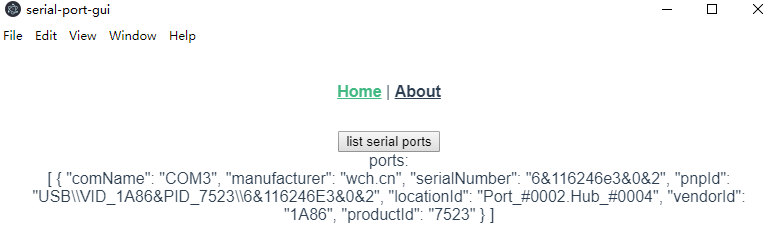

# serial-port-gui

> I am trying to write an gui application using Electron and Vue.js, so I init a Vue.js demo project and add electron-builder plugins into the Vue.js demo project. This is a demo of how to make it work on Windows system.



## 1. The software or library you need to install

1. **Node.js**, download from offical site, extract the directroy, and setup the `PATH` environment variables
* if you are in china, maybe you need to set the taobao mirror, `npm config set registry http://registry.npm.taobao.org/` 
	
2. **Yarn**, `npm install -g yarn`
	* if you are in china, maybe you need to set the taobao mirror,  `yarn config set registry http://registry.npm.taobao.org/`
3. **vue-cli 3**，`npm install -g @vue/cli`
4. **Python2.7**，download from offical site, and install
5. **VCBuild.exe**，normally you need to install `.Net Framework 2.0` or `Visual Studio 2015`, but you can install `windows-build-tools`instead
	* open power shell with Administrator privilege, `npm install --global --production windows-build-tools`

## 2. Create the demo project

### 2.1. Use vue-cli 3 to create a project called`serial-port-gui`

```bash
vue create serial-port-gui

## I choose this options:

## Vue CLI v4.0.5
## ? Please pick a preset: 
## ----> Manually select features
## ? Check the features needed for your project: 
## ----> Babel, Router, Vuex, CSS Pre-processors, Linter
## ? Use history mode for router? (Requires proper server setup for index fallback in production) 
## ----> No
## ? Pick a CSS pre-processor (PostCSS, Autoprefixer and CSS Modules are supported by default): 
## ----> Less
## ? Pick a linter / formatter config: 
## ----> Basic
## ? Pick additional lint features: (Press <space> to select, <a> to toggle all, <i> to invert selection)
## ----> Lint on save
## ? Where do you prefer placing config for Babel, PostCSS, ESLint, etc.? 
## ----> In dedicated config files
## ? Save this as a preset for future projects? (y/N)
## ----> N
```

The most important is `Use history mode for router` must be `No`, because Electron use `hash mode` default.

### 2.2. Enter project directory, add vue plugin:`electron-build`, and project dependency:`serialport`

#### 2.2.1 add vue plugin: `electron-builder`

```bash
vue add electron-builder
```

> **If you are in china, download is too slow, you should download from [here](https://npm.taobao.org/mirrors/electron), and add the software to you system by youself, see detail as follow:**
>
> 1. download the right version of `electron` from thie site: https://npm.taobao.org/mirrors/electron
>
> 2. remember also download the file `SHASUMS256.txt` and add a version suffix like `SHASUMS256.txt-6.1.2`
> 3. copy files to `C:\Users\USER_NAME\.electron`
> 4. for example:
>
> ```
> C:\Users\caibh\.electron
>   |
>   |--chromedriver-v6.1.2-win32-x64.zip
>   |--electron-v6.1.2-win32-x64.zip
>   |--SHASUMS256.txt-6.1.2
> ```
>
> Also, if you run `yarn electron:build`to package, it occur to the same problem in china, so also copy to `C:\Users\USER_NAME\AppData\Local\electron\Cache`, for example：
>
> ```
> C:\Users\caibh\AppData\Local\electron\Cache
>   |
>   |--chromedriver-v6.1.2-win32-x64.zip
>   |--electron-v6.1.2-win32-x64.zip
>   |--SHASUMS256.txt-6.1.2
> ```

#### 2.2.2 add project dependency: `serialport`

```
yarn add serialport
```

If you have not install `Python 2.7` and `windows-build-tools`，you will got error here, so be sure you have installed.

### 2.3. Mark `serialport` as an external by setting  `vue.config.js`

create the file called `vue.config.js` under the project directory, and setting as follow:

```
// vue.config.js
module.exports = {
    pluginOptions: {
        electronBuilder: {
            // List native deps here if they don't work
            externals: ['serialport'],
            // If you are using Yarn Workspaces, you may have multiple node_modules folders
            // List them all here so that VCP Electron Builder can find them
            nodeModulesPath: ['../../node_modules', './node_modules']
        }
    }
}
```

### 2.4. Write test code

open `serial-port-gui/src/views/Home.vue`, and replace all the codes by the following codes:

```xml
<template>
  <div class="home">
    <button @click="listSerialPorts">list serial ports</button>
    <div>ports:</div>
    <div>{{ports}}</div>
  </div>
</template>

<script>
  const serialport = require('serialport')
  export default {
    name: 'home',
    data(){
      return {
        ports: ['empty']
      }
    },
    methods: {
      listSerialPorts() {
        serialport.list((err, ports) => {
          if (ports.length===0){
            this.ports = ['empty']
          }else{
            this.ports = ports
          }
        })
      }
    }
  }
</script>
```

### 2.5. Package an `exe` file

```bash
yarn electron:build
```

> If you are in china, when you execute `yarn electron:build`, it will be slow when it's download dependency, you can see info like this:
>
> ```
>  • rebuilding native dependency  name=@serialport/bindings version=2.0.8
>   • packaging       platform=win32 arch=x64 electron=6.1.2 appOutDir=dist_electron\win-unpacked
>   • default Electron icon is used  reason=application icon is not set
>   • downloading     url=https://github.com/electron-userland/electron-builder-binaries/releases/download/winCodeSign-2.5.0/winCodeSign-2.5.0.7z size=5.6 MB parts=1
> ```
>
> So you should download by you hand from here: https://github.com/electron-userland/electron-builder-binaries/releases/
>
> All i need is `nsis`,`nsis-resources`,`winCodeSign`, because I just need to package a `exe`
> 
> After downloaded extract files and copy to `C:\Users\USER_NAME\AppData\Local\electron-builder\Cache`，for example:
>
> ```
>C:\Users\caibh\AppData\Local\electron-builder\Cache
> |
> |--nsis
>   |--nsis-resources
>   |--winCodeSing
>   ```

## 3. Knowing issue

### 3.1 @serialport/binding prebuild-install 404

When execute `yarn`, will got an 404 error like this:

```
$ yarn
yarn install v1.19.1
[1/4] Resolving packages...
[2/4] Fetching packages...
info fsevents@1.2.9: The platform "linux" is incompatible with this module.
info "fsevents@1.2.9" is an optional dependency and failed compatibility check. Excluding it from installation.
info fsevents@2.1.1: The platform "linux" is incompatible with this module.
info "fsevents@2.1.1" is an optional dependency and failed compatibility check. Excluding it from installation.
[3/4] Linking dependencies...
warning " > less-loader@5.0.0" has unmet peer dependency "webpack@^2.0.0 || ^3.0.0 || ^4.0.0".
[4/4] Building fresh packages...
$ electron-builder install-app-deps
  • electron-builder  version=21.2.0
  • rebuilding native dependencies  dependencies=@serialport/bindings@2.0.8 platform=linux arch=x64
  • install prebuilt binary  name=@serialport/bindings version=2.0.8 platform=linux arch=x64
  • build native dependency from sources  name=@serialport/bindings
                                          version=2.0.8
                                          platform=linux
                                          arch=x64
                                          reason=prebuild-install failed with error (run with env DEBUG=electron-builder to get more information)
                                          error=prebuild-install info begin Prebuild-install version 5.3.2
    prebuild-install info looking for cached prebuild @ /home/caibh/.npm/_prebuilds/62a8e4-bindings-v2.0.8-electron-v73-linux-x64.tar.gz
    prebuild-install http request GET https://github.com/node-serialport/node-serialport/releases/download/v2.0.8/bindings-v2.0.8-electron-v73-linux-x64.tar.gz
    prebuild-install http 404 https://github.com/node-serialport/node-serialport/releases/download/v2.0.8/bindings-v2.0.8-electron-v73-linux-x64.tar.gz
    prebuild-install WARN install No prebuilt binaries found (target=6.1.1 runtime=electron arch=x64 libc= platform=linux)
    
  • rebuilding native dependency  name=@serialport/bindings version=2.0.8
Done in 35.12s.
```

`It doesn't matter!`, let me explain:

It means yarn try to build native dependency of `@serialport/binding version 2.0.8` with the following step :

1. try to find cache in local
2. try to download from github repo if exist, actually not found, so it got response 404
3. if both not found in cache or github, build by myself

So finally it rebuild success:

```bash
  • rebuilding native dependency  name=@serialport/bindings version=2.0.8
Done in 35.12s.
```

